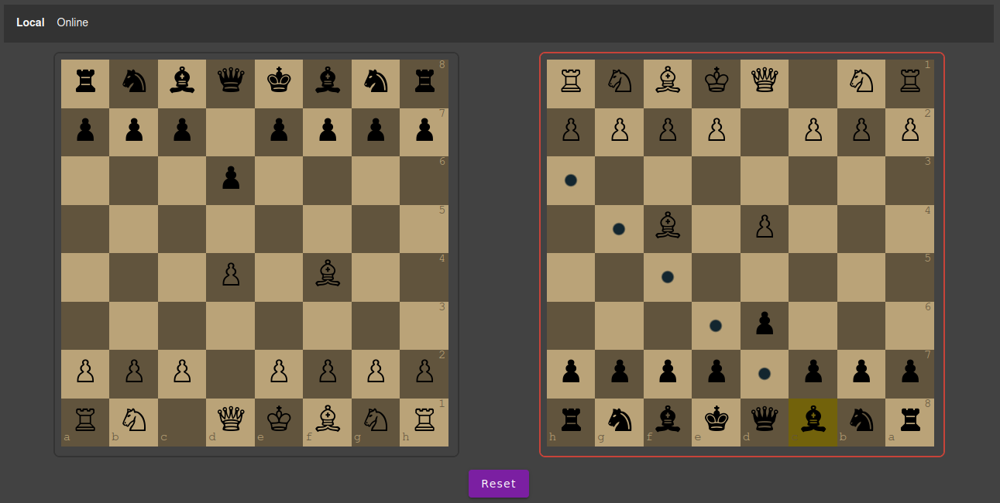
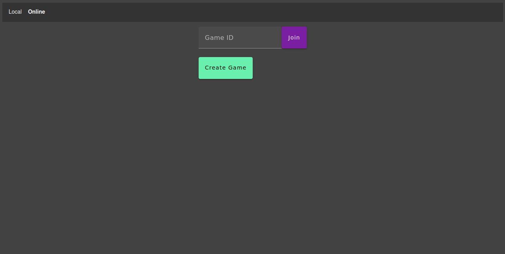
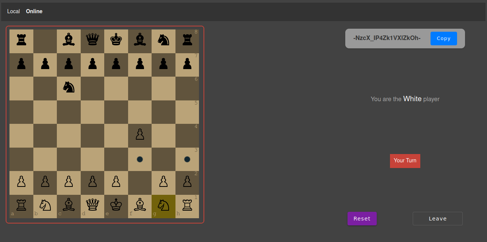
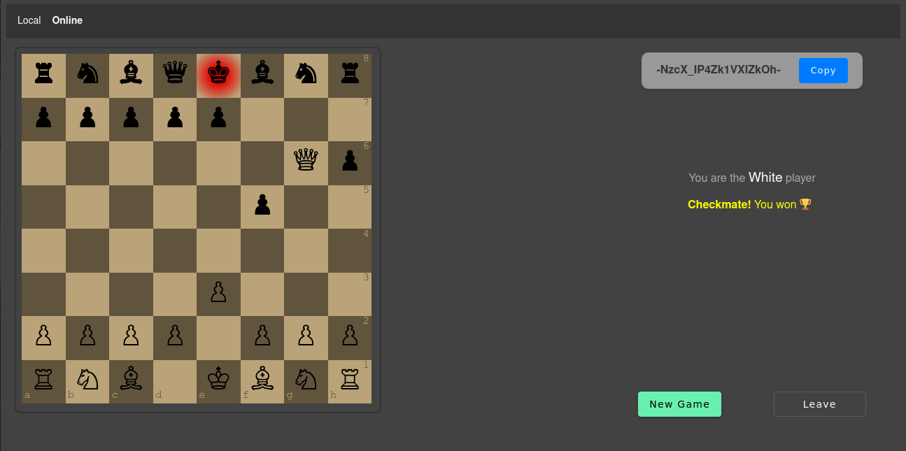

# ChessMultiplayer

<a href="https://chess-multiplayer-a8872.web.app/" target="_blank">URL</a>

This project was generated with [Angular CLI](https://github.com/angular/angular-cli) version 16.2.14.

# Screenshots

### Local Mode

### Online Mode

## TODO

- [ ] Handle unexpected leave or shutdown
- [ ] Implement unit test

## Development server

Run `ng serve` for a dev server. Navigate to `http://localhost:4200/`. The application will automatically reload if you change any of the source files.

